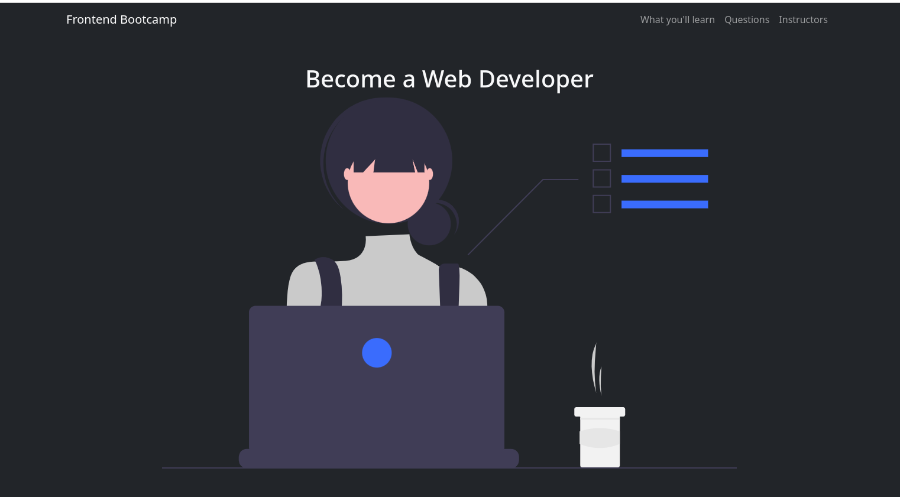
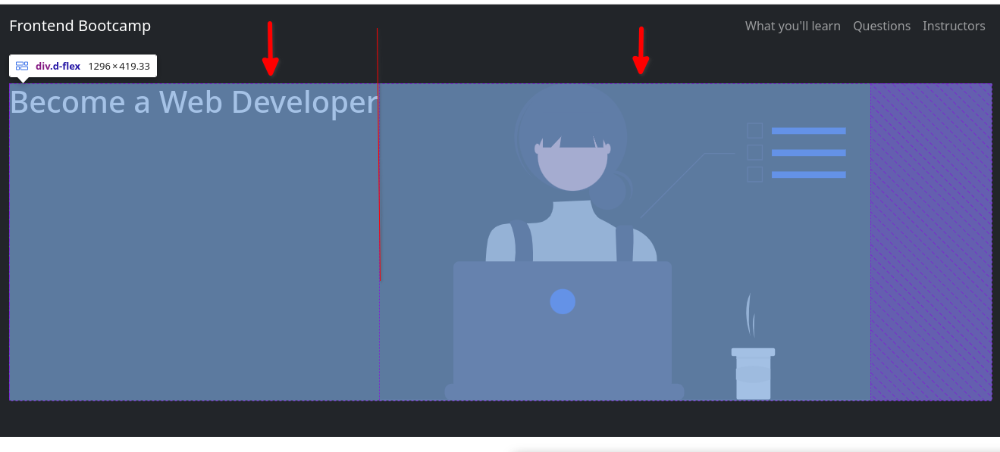
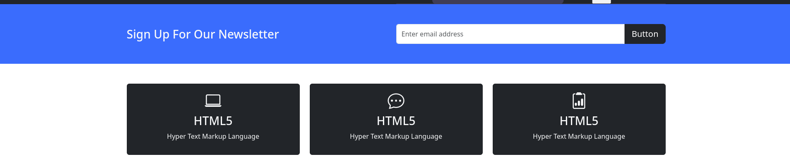
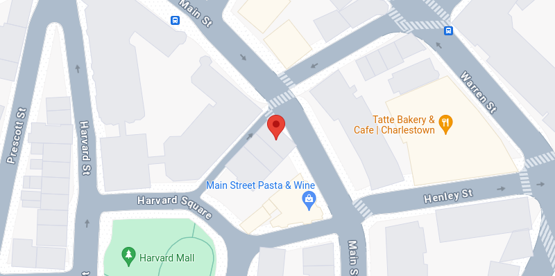
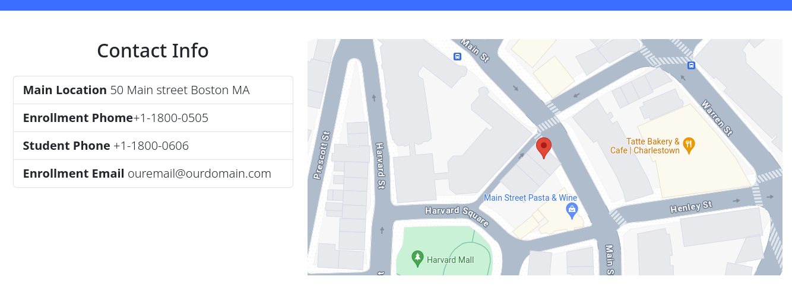

## El NavBar

Creamos un NavBar en la parte superior de la página:

```html
<nav class="navbar navbar-expand-lg bg-dark navbar-dark">
```
**navbar-expand-lg**: indica que a partir del tamaño LG, debe mostrar el elemento.

**navbar-dark**: indica que se usará un fondo oscuro. (según los colores definidos por el theme de Bootstrap)

Posrteriormente vamos a agregar todo el contenido del navbar dentro de un contenedor para agregar espacios en los bordes.

Seguidamente agregamos un link con el texto **Frontend Bootcamp**

```html
<a href="#" class="navbar-brand">Frontend Bootcamp</a>
```
**navbar-brand**: Esta clase se usa para identificar y estilizar el elemento de la marca o logotipo en una barra de navegación. Generalmente se aplica a un enlace `<a>` o a un elemento de cabecera `<span>` o `<h1>`.

EL siguiente elemento es el toggle Buton,

```html
<button class="navbar-toggler" type="button"
    data-bs-toggle="collapse" data-bs-target="#navmenu">
    <span class="navbar-toggler-icon"></span>
</button>
```

**navbar-toggler:** Esta clase se utiliza para diseñar el botón que activa la visualización de la barra de navegación colapsada en pantallas más pequeñas. Le da un estilo predeterminado de Bootstrap paraque sea fácilmente reconocible como un botón de menú desplegable.

**navbar-toggler-icon:** Esta clase se aplica a un elemento dentro del botón navbar-toggler para crear el icono visual del botón. Por lo general, este icono consiste en tres líneas horizontales (a veces llamado "icono de hamburguesa") que indican que el botón puede expandir o contraer la barra de navegación.

### Atributos

**type="button":**  Este atributo especifica que el elemento es un botón de tipo button, lo cual es importante para los elementos interactivos.

**data-bs-toggle="collapse":** Este atributo le indica a Bootstrap que este botón debe controlar el comportamiento de colapso (mostrar u ocultar) de otro elemento. Utiliza el plugin JavaScript de Bootstrap para manejar la interacción.

**data-bs-target="#navmenu":** Este atributo especifica el elemento objetivo que debe colapsarse o expandirse cuando se haga clic en el botón. El valor **#navmenu** es un selector CSS que corresponde al id del elemento objetivo (en este caso, un menú de navegación con `id="navmenu"`).

Como tercer elemento del NavBar agregamos las opciones:

```html
<div class="collapse navbar-collapse" id="navmenu">
    <ul class="navbar-nav ms-auto">
        <li class="nav-item">
            <a href="#learn" class="nav-link">What you'll learn</a>
        </li>
        <li class="nav-item">
            <a href="#questions" class="nav-link">Questions</a>
        </li>
        <li class="nav-item">
            <a href="#instructors" class="nav-link">Instructors</a>
        </li>
    </ul>
</div>
```


**collapse:** Esta clase se utiliza para crear un contenedor colapsable. En combinación con el atributo data-bs-toggle="collapse" en el botón del ejemplo anterior, permite que el contenido dentro de este div se expanda o contraiga.

**navbar-collapse:** Esta clase específica de Bootstrap se utiliza para aplicar estilos y comportamientos de colapso a los elementos de la barra de navegación en dispositivos de tamaño más pequeño.

**id="navmenu":** Este atributo asigna un identificador único al elemento, que se utiliza como objetivo del atributo data-bs-target en el botón de navegación (navbar-toggler). Permite que el botón controle la expansión y contracción de este menú.

**navbar-nav:** Esta clase se usa en un contenedor `<ul>` para aplicar estilos de lista de navegación a los elementos de la barra de navegación. Asegura que los elementos de la lista se estilicen correctamente como enlaces de navegación.

**ms-auto:** Esta clase de utilidades de Bootstrap (margin-start auto) se utiliza para empujar los elementos de la lista de navegación hacia la derecha (en un diseño de izquierda a derecha). Hace que el contenido de la lista se alinee a la derecha dentro de su contenedor.

**nav-item:** Esta clase se aplica a los elementos `<li>` dentro de la lista de navegación. Se usa para estilizar los elementos de la lista como elementos de navegación.

**nav-link:** Esta clase se aplica a los elementos `<a>` dentro de los elementos de la lista de navegación `(<li class="nav-item">)`. Asegura que los enlaces se estilicen correctamente como enlaces de navegación.

El código completo del Navbar es:

```html
<nav class="navbar navbar-expand-lg bg-dark navbar-dark">
    <div class="container">
        <a href="#" class="navbar-brand">Frontend Bootcamp</a>
        <button class="navbar-toggler" type="button"
            data-bs-toggle="collapse" data-bs-target="#navmenu">
            <span class="navbar-toggler-icon"></span>
        </button>
        <div class="collapse navbar-collapse" id="navmenu">
            <ul class="navbar-nav ms-auto">
                <li class="nav-item">
                    <a href="#learn" class="nav-link">What you'll learn</a>
                </li>
                <li class="nav-item">
                    <a href="#questions" class="nav-link">Questions</a>
                </li>
                <li class="nav-item">
                    <a href="#instructors" class="nav-link">Instructors</a>
                </li>
            </ul>
        </div>
    </div>
</nav>
```

Restultado:

Large >


Por debajo de Large


Menú desplegado


<div style="page-break-after: always;"></div>

## Showcase

Esta es una sección de presentación de la página, aparece justo despues del navBar

Iniciamos con la estructura base

```html
<!-- ========== Start ShowCase ========== -->
 <section class="bg-dark text-light p-5 text-center">
    <div class="container">
        <div>
            <div>
                <h1>Become a Web Developer</h1>
            </div>
            
        </div>
    </div>
 </section>
<!-- ========== End ShowCase ========== -->
```
Por el momento esto genera el siguiente HTML:



## D-Flex

La clase **d-flex** en Bootstrap 5 aplica el display flex al elemento sobre el que se utiliza. Esto convierte al elemento en un contenedor flexible, habilitando el uso de las propiedades y funcionalidades del modelo de caja flexible (Flexbox) de CSS.

```html
<div class="container">
    <div class="d-flex">
        <div>
            <h1>Become a Web Developer</h1>
        </div>
        
    </div>
</div>
```

La clase **img-fluid** en Bootstrap se utiliza para hacer que una imagen sea responsiva. Esto significa que la imagen se adaptará automáticamente al tamaño del contenedor padre, manteniendo su proporción original sin desbordarse.

Adicionalmente, reducimos en un 50% el tamaño de la imagen usando la clase **w-50**

Tal como se puede observa en esta imagen, el **d-flex** crea dos columnas, una para cada elemento y ahora vemos una imagen mas reducida.




## d-flex en vistas mobile

Si en la vista mobile queremos evitar las dos columnas, y en su lugar mostrar el texto primero y luego la imagen, debemos de cambiar el d-flex por d-sm-flex.

Ahora agregamos un span para cierta parte del H1 y un parrafo


```html
<div class="d-sm-flex">
    <div>
        <h1>Become a <span class="text-warning">Web Developer</span></h1>
        <p>We focus on teaching our students the fundamentals of the latest
            and greatest technologies to prepare them for their first dev role</p>
    </div>
    
</div>
```

Esto genera las siguientes salidas en vistas LG+


o Mobile


## Alineación del texto

Al combinar las clases `text-center text-sm-start` el texto se mostrará alineado a la derecha en dispositivos grandes y centrado en dispositivos SM o menores.

```html
<section class="bg-dark text-light p-5 text-center text-sm-start">
```
Adicionalmente podemos agregar un Btn luego del párrafo,

```html
<button class="btn btn-primary btn-lg my-4">
    Start the Enrollment
</button>
```

 y agregar algunos margenes en Y con `my-4` y tendremos como resultado:


## Ocultar elementos

Si deseamos ocultar la imagen en vistas SM o inferiores y mantenerlo para todas las demas debemos combinar las clases: `d-none d-sm-block` **d-none** oculta la imagen por defecto en todos los dispositivo, es decir define el estado inicial como oculto, y luego **d-sm-block** mostrará la imagen para los dispositivos SM o mayores

```html

```

## Centrar Veritcalmente

Al agregar las clases `align-items-center justify-content-between` se centrará el texto veritcalmente

```html
<div class="d-sm-flex align-items-center justify-content-between">
```

Y este es el resultado final de la sección **ShowCase**


```html
<!-- ========== Start ShowCase ========== -->
<section class="bg-dark text-light p-5 p-lg-0 text-center text-sm-start">
   <div class="container">
       <div class="d-sm-flex align-items-center justify-content-between">
           <div>
               <h1>Become a <span class="text-warning">Web Developer</span></h1>
               <p class="lead my-4">We focus on teaching our students the fundamentals of the latest
                   and greatest technologies to prepare them for their first dev role</p>
                   <button class="btn btn-primary btn-lg my-4">
                       Start the Enrollment
                   </button>
           </div>
           
       </div>
   </div>
</section>
<!-- ========== End ShowCase ========== -->
```


## Cambios en los márgenes

NOTA: Las clases `p-lg-0` se agregó posteriormente, para elimina los margenes en Y para pantallas grandes. Eso une la sección de **ShowCase** con la de **Newsletter**

<div style="page-break-after: always;"></div>

## Sección NewsLetter

La sección completa es la siguiente

```html
<!-- ========== Start Newsletter ========== -->
<section class="bg-primary text-light p-5">
    <div class="container">
        <div class="d-md-flex align-items-center justify-content-between">
            <h3 class="mb-3 mb-md-0">
                Sign Up For Our Newsletter
            </h3>
            <div class="input-group newsletter-input">
                <input
                    type="text"
                    class="form-control"
                    placeholder="Enter email address">
                <button
                    class="btn btn-dark btn-lg"
                    type="button"
                    id="btn-newsletter">
                        Button
                </button>
              </div>
        </div>
    </div>
</section>
```

Las clases basicamente son las mismas que hemos usado en la sección anterior. En el caso de `mb-3 mb-md-0` del H3, aplicamos un margen bottom de 3, pero para size Md lo establecemos en 0


<div style="page-break-after: always;"></div>

## Sección Boxes
Agregaremos tres boxes con diferente información. Para esta sección se usara el sistema de GRID, basado en filas (row) y columnas (col)

```html
<section class="p-5">
    <div class="container">
        <div class="row text-center g-4">
            <div class="col">box 1</div>
            <div class="col">box 2</div>
            <div class="col">box 3</div>
        </div>
    </div>
</section>
```

En este caso definimos tener siempre 3 columnas, independientemente del tamaño del dispositivo. Pero al cambiar cada clase `col` por `col-md`, le indicamos al sistema que use las columnas a partir del size md, antes, para dispositivos pequeños debe colocar cada DIV o box en una fila diferente.

`g-4` GAP, crea un espacio entre las tarjetas. Esto evita que se mantengan unidas en las vistas pequeñas


Usaremos el componente de bootsrap **Cards** y también hacemos uso de los iconos de bootsrap (https://icons.getbootstrap.com/#install)


Por ejemplo dentro de cada DIV.col-md podemos agregar 3 cards para cada columna

```html
<div class="card bg-dark text-light">
    <div class="card-body">
        <div class="h1">
            <i class="bi bi-laptop"></i>
        </div>
        <h3>HTML5</h3>
        <p>Hyper Text Markup Language</p>
    </div>
</div>
```
Notas que hemos agregado una clase h1 a un DIV para agrandar el icono

```html
<div class="h1">
    <i class="bi bi-laptop"></i>
</div>
```

Esto generará el siguiente html




El código final de 1 de las 3 cajas es el siguiente:

```html
<div class="col-md">
    <div class="card bg-dark text-light">
        <div class="card-body">
            <div class="h1 mb-3">
                <i class="bi bi-laptop"></i>
            </div>
            <h3>Virtual</h3>
            <p class="card-text">
                Internet has revolutionized communication and access to information.
                It connects people globally, enabling instant sharing of data,
                ideas, and media. This digital network has transformed how we live
                and work.
            </p>
            <a href="#" class="btn btn-primary">Read More</a>
        </div>
    </div>
</div>
```

Repetimos el mismo código para las 3er caja, y cambiamos un par de clase para la segunda y el resultado será:


<div style="page-break-after: always;"></div>

## Sección Learns

Vamos a implementar la siguiente sección, usaremos el sistema basado en rows y cols. Constara de dos columnas, un gráfico a la izquierda y un texto a la derecha.

```html
<section id="learn" class="p-5">
   <div class="container">
       <div class="row align-items-center justify-content-between">
           <div class="col-md">
               
           </div>
           <div class="col-md p-5">
              <h2>Learn The Fundamentals</h2>
              <p class="lead">
                     Our bootcamp teaches the latest in web development. We focus on the fundamentals
                     to ensure you have a solid foundation. This will allow you to learn any language
                     or tool quickly.
              </p>
              <p>
               We want you to learn the latest tools and technologies so you can get your first
               dev job. We focus on real-world projects that will help you build a portfolio to
               show employers.
              </p>
              <p>
                     <i class="bi bi-check2"></i> HTML5, CSS3, JavaScript
              </p>
               <a href="#" class="btn btn-light mt-3">
                   <i class="bi bi-chevron-right"></i> Read More
               </a>
           </div>
       </div>
   </div>
</section>
```

Resultado


<div style="page-break-after: always;"></div>

## Sección Learn React

Copiamos la sección anterior y aplicamos un par de cambios


```html
<section class="p-5 bg-dark text-light">
   <div class="container">
       <div class="row align-items-center justify-content-between">
           <div class="col-md p-5">
              <h2>Learn React</h2>
              <p class="lead">
               you will learn React, a popular JavaScript library for building user interfaces.
               React is used by companies like Facebook, Instagram, and Netflix to create fast,
               scalable web applications.
              </p>
              <p>
               React is a powerful tool for building web applications. It allows you to create
               reusable components that can be used to build complex user interfaces. React also
               makes it easy to manage the state of your application, making it easier to build
               interactive web applications.
              </p>
              <p>
                     <i class="bi bi-check2"></i> React, node.js, Express, MongoDB
              </p>
               <a href="#" class="btn btn-light mt-3">
                   <i class="bi bi-chevron-right"></i> Read More
               </a>
           </div>
           <div class="col-md">
               
           </div>
       </div>
   </div>
</section>
```


<div style="page-break-after: always;"></div>

## Sección Questions

Antes de aplicar esta sección, vamos a fijar el top Navbar en la parte superior, para que siempre se muestre aun cuando hacemos scrolldown, para ello agregamos la clase  **fixed-top**

```html
<nav class="navbar navbar-expand-lg bg-dark navbar-dark py-3 fixed-top">
```

Adiconalmete debemos mover la primer sección un poco por hacia abajo para mostrarla completamente, ya que parte de la sección showCase queda escondida detrás del navBar. Para esto agregamos el siguiente custom CSS

```css
body::before {
  display: block;
  content: "";
  height: 60px;

}
```

Este CSS inserta un espacio en blanco de 60 píxeles de alto antes del contenido del body. Este espacio se utiliza para crear un margen superior adicional para acomodar la barra de navegación fija sin superponer el contenido principal de la página.

Ahora si, creamos la sección de Questions. Agregamos la sección con una pregunta

```html
<section id="questions" class="p-5">
        <div class="container">
            <h2 class="text-center mb-2">
                Frequently Asked Questions
            </h2>
            <div class="accordion accordion-flush" id="acc-questions">
                <div class="accordion-item">
                  <h2 class="accordion-header">
                    <button
                        class="accordion-button collapsed"
                        type="button"
                        data-bs-toggle="collapse"
                        data-bs-target="#question-one">
                      How does this bootcamp work?
                    </button>
                  </h2>
                  <div id="question-one" class="accordion-collapse collapse" data-bs-parent="#acc-questions">
                    <div class="accordion-body">
                        This bootcamp is designed to teach you the skills you need to get your first
                        job as a web developer. We focus on the fundamentals of web development to
                        ensure you have a solid foundation. We also focus on real-world projects that
                        will help you build a portfolio to show employers.
                    </div>
                  </div>
                </div>
            </div>
        </div>
     </section>
     ```

Resultado


<div style="page-break-after: always;"></div>

## Sección Instructores


```html
<section id="Instructors" class="bg-primary p-5 text-light">
   <div class="container">
       <h2 class="text-center text-white">
           Our Instructors
       </h2>
       <p class="lead text-center text-white mb-5">
           Our instructors are experienced web developers who are passionate about teaching.
       </p>
       <div class="row g-4">
           <div class="col-md-6 col-lg-3">
               <card class="card bg-light p-5">
                   <div class="card-body text-center">
                       
                           Michael Hutchence
                       </h4>
                       <p class="card-text text-center">
                           Lorem ipsum, dolor sit amet consectetur adipisicing elit. Nemo, vitae.
                       </p>
                       <a href="#"><i class="bi-twitter text-dark mx-1"></i></a>
                       <a href="#"><i class="bi-facebook text-dark mx-1"></i></a>
                       <a href="#"><i class="bi-linkedin text-dark mx-1"></i></a>
                       <a href="#"><i class="bi-instagram text-dark mx-1"></i></a>
                   </div>
               </card>
           </div>
       </div>
   </div>
</section>
```
Agregamos 3 Tarjetas más, Resultado


<div style="page-break-after: always;"></div>

## Sección Información de Contacto

```html
<!-- ========== Start Contact and Map ========== -->
<section class="p-5">
   <div class="container">
       <div class="row g-4">
           <div class="col-md">
               <h2 class="text-center mb-4">Contact Info</h2>
               <ul class="list-group li-group-flush lead">
                   <li class="list-group-item">
                       <span class="fw-bold">Main Location</span> 50 Main street Boston MA
                   </li>
                   <li class="list-group-item">
                       <span class="fw-bold">Enrollment Phome</span>+1-1800-0505
                   </li>
                   <li class="list-group-item">
                       <span class="fw-bold">Student Phone</span> +1-1800-0606
                   </li>
                   <li class="list-group-item">
                       <span class="fw-bold">Enrollment Email</span> ouremail@ourdomain.com
                   </li>
               </ul>
           </div>
           <div class="col-md">
               
           </div>
       </div>
   </div>
</section>
```




<div style="page-break-after: always;"></div>

## Sección Footer

```html
<!-- ========== Start Footer ========== -->
     <footer class="p-5 bg-dark text-white text-center postitio-relative">
        <div class="container">
            <p class="lead">
                Copyright &copy; 2024 Frontend Bootcamp
            </p>
            <a href="#" class="position-relative bottom-0 end-0 p-5">
                <i class="bi bi-arrow-up-circle h1"></i>
            </a>
        </div>
     </footer>
    <!-- ========== End Footer ========== -->
```


## Agregando un Modal

En el ShowCase tenemos este boton

```html
<button class="btn btn-primary btn-lg my-4">
    Start the Enrollment
</button>
```

Vamos a mostrar un modal al hacer click. Lo primero es que debemos agregasr la clases: `data-bs-toggle="modal" data-bs-target="#enroll"`

COpiamos algun modal de los componentes de bootsrap y cambiamos su id por enroll

```html
<div class="modal fade" id="enroll" tabindex="-1">
```


